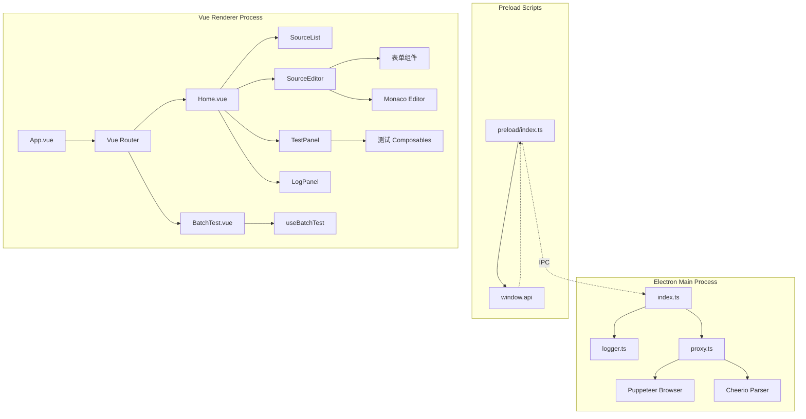
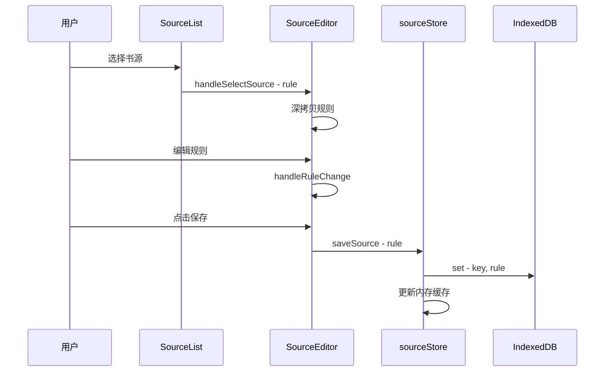
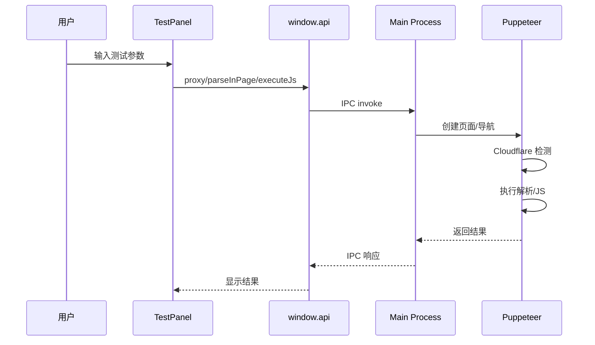
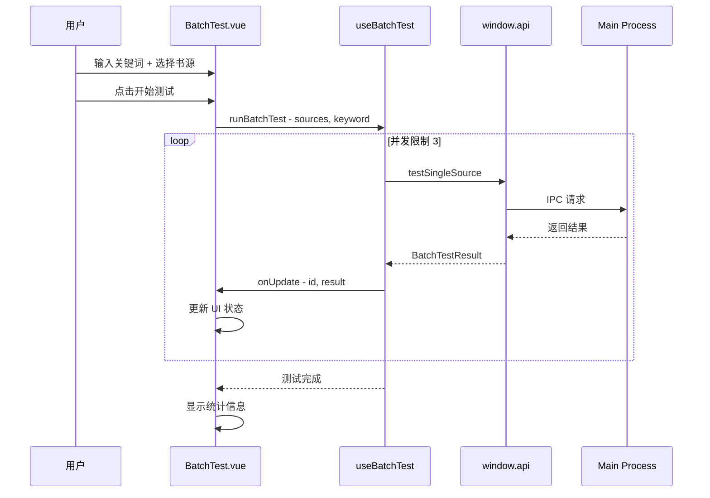

# Reader Source - 系统架构

## 架构概览

Reader Source 采用 Electron + Vue 3 的桌面应用架构，分为主进程、预加载脚本和渲染进程三层。



## 目录结构

```
docs/                              # 用户文档
├── rule-guide.md                  # 规则编写指南
├── universal-rule-spec.md         # 规则规范设计方案
└── universal-rule-schema.json     # JSON Schema 定义

src/
├── main/                          # Electron 主进程
│   ├── index.ts                   # 主进程入口，窗口管理
│   ├── logger.ts                  # 日志记录模块
│   └── proxy.ts                   # 网络代理/解析模块
│
├── preload/                       # 预加载脚本
│   ├── index.ts                   # 暴露 IPC API
│   └── index.d.ts                 # TypeScript 类型声明
│
└── renderer/src/                  # Vue 渲染进程
    ├── App.vue                    # 根组件（路由容器）
    ├── main.ts                    # 应用入口
    │
    ├── components/                # UI 组件
    │   ├── SourceList.vue         # 书源列表组件
    │   ├── LogPanel.vue           # 日志面板
    │   ├── MonacoEditor.vue       # Monaco 编辑器封装
    │   ├── Resizer.vue            # 面板分隔拖拽
    │   │
    │   ├── source-editor/         # 规则编辑器模块
    │   │   ├── SourceEditor.vue   # 编辑器主组件
    │   │   ├── EditorToolbar.vue  # 工具栏
    │   │   └── forms/             # 规则表单组件
    │   │       ├── BasicInfoForm.vue      # 基本信息
    │   │       ├── SearchRuleForm.vue     # 搜索规则
    │   │       ├── ChapterRuleForm.vue    # 章节规则
    │   │       ├── DiscoverRuleForm.vue   # 发现规则
    │   │       └── ContentRuleForm.vue    # 正文规则
    │   │
    │   └── test-panel/            # 测试面板模块
    │       ├── TestPanel.vue      # 测试面板主组件
    │       ├── composables/       # 测试逻辑 Composables
    │       │   ├── index.ts
    │       │   ├── useTestLogic.ts
    │       │   ├── useSearchTest.ts
    │       │   ├── useChapterTest.ts
    │       │   ├── useContentTest.ts
    │       │   ├── useDiscoverTest.ts
    │       │   └── useBatchTest.ts        # 批量测试逻辑
    │       ├── inputs/            # 测试输入组件
    │       │   ├── SearchInput.vue
    │       │   ├── ChapterInput.vue
    │       │   ├── ContentInput.vue
    │       │   └── DiscoverInput.vue
    │       └── results/           # 测试结果组件
    │           ├── ResultTabs.vue
    │           ├── BookResultList.vue     # 书籍结果（搜索/发现共用）
    │           ├── ChapterResultList.vue
    │           └── ContentPreview.vue
    │
    ├── schemas/                   # JSON Schema 定义
    │   └── universalRuleSchema.ts # 规则 Schema（Monaco 集成）
    │
    ├── stores/                    # Pinia 状态管理
    │   ├── sourceStore.ts         # 书源状态管理
    │   └── logStore.ts            # 日志状态管理
    │
    ├── types/                     # TypeScript 类型定义
    │   ├── index.ts               # 类型入口（含日志类型）
    │   └── universal.ts           # 规则类型定义（136行）
    │
    ├── router/                    # Vue Router 配置
    │   └── index.ts               # 路由定义（含 /batch-test）
    │
    └── views/                     # 页面视图
        ├── Home.vue               # 主页面
        └── BatchTest.vue          # 批量测试页面
```

## 核心模块详解

### 1. 主进程 - proxy.ts

网络代理和解析模块，提供以下 IPC 处理器：

| IPC 通道            | 功能          | 实现方式                |
| ------------------- | ------------- | ----------------------- |
| `proxy:fetch`       | HTTP 代理请求 | Puppeteer 无头浏览器    |
| `proxy:parse`       | HTML 解析     | Cheerio (服务端)        |
| `proxy:parseInPage` | 页面内解析    | Puppeteer + DOM API     |
| `proxy:executeJs`   | JS 规则执行   | Puppeteer page.evaluate |
| `proxy:image`       | 图片代理      | fetch + Base64 转换     |

**Cloudflare 处理**：

- 自动检测验证页面（标题/内容关键词）
- 等待重试机制（5秒间隔，最多6次）
- 支持 DEBUG_MODE 显示浏览器窗口

### 2. 类型系统

```typescript
// 类型层次结构
UniversalRule (书源规则)
├── 基本信息: id, name, host, icon, author, group, sort
├── 内容类型: contentType (novel/manga)
├── 请求设置: userAgent, headers, loadJs
├── 规则配置
│   ├── search?: UniversalSearchRule
│   ├── detail?: UniversalDetailRule
│   ├── chapter?: UniversalChapterRule
│   ├── discover?: UniversalDiscoverRule
│   └── content?: UniversalContentRule
└── 元数据: _meta (sourceFormat: universal, version, timestamps)
```

### 3. 状态管理 - sourceStore

```typescript
// 主要状态
sources: UniversalRule[]        // 所有规则（内存缓存）
currentSource: UniversalRule    // 当前选中规则
loading: boolean                // 加载状态
searchQuery: string             // 搜索关键词

// 核心方法
loadSources()                   // 从 IndexedDB 加载
saveSource(rule)                // 保存规则
deleteSource(id)                // 删除规则
importSources(json)             // 导入规则
exportSources()                 // 批量导出
clearAllSources()               // 清空所有
```

**存储策略**：

- IndexedDB 键格式: `rule_{id}`
- 内存缓存 + IndexedDB 双层存储
- 按 sort 权重降序排列

### 4. 测试面板 Composables

采用 Vue 3 Composition API 组织测试逻辑：

```typescript
// useTestLogic.ts - 通用测试框架
function useTestLogic<TInput, TResult>({
  testFn, // 测试函数
  inputValidator, // 输入验证
  onSuccess, // 成功回调
  onError // 错误回调
})

// 具体测试 Composables
useSearchTest(rule) // 搜索测试
useChapterTest(rule) // 章节测试
useContentTest(rule) // 正文测试
useDiscoverTest(rule) // 发现测试
useBatchTest() // 批量测试
```

### 5. 批量测试模块

```typescript
// useBatchTest.ts - 批量测试 Composable
interface BatchTestResult {
  status: 'pending' | 'running' | 'success' | 'error'
  count: number // 结果数量
  error?: string // 错误信息
  duration?: number // 耗时（毫秒）
  visualData?: SearchResult[] // 可视化数据
  parsedResult?: unknown[] // 解析结果
  rawHtml?: string // 原始 HTML
}

function useBatchTest() {
  // 批量执行测试（并发限制为 3）
  async function runBatchTest(
    sources: UniversalRule[],
    keyword: string,
    onUpdate: (id: string, result: BatchTestResult) => void
  ): Promise<void>

  // 单书源测试
  async function testSingleSource(source: UniversalRule, keyword: string): Promise<BatchTestResult>
}
```

### 6. JSON Schema 集成

```typescript
// schemas/universalRuleSchema.ts
// 用于 Monaco Editor 的 JSON 验证和智能提示

export const universalRuleSchema = {
  $schema: 'http://json-schema.org/draft-07/schema#',
  title: 'Universal Rule',
  description: '书源规则规范 - Scripting Reader 插件规则格式'
  // ...完整 schema 定义
}
```

## 数据流

### 规则编辑流程



### 规则测试流程



### 批量测试流程



## 关键设计决策

### 1. Universal 格式作为唯一存储格式

- **原因**: 专注于 Scripting Reader 插件，简化架构
- **实现**: 直接使用 Universal 格式存储和编辑

### 2. Puppeteer 作为网络解析引擎

- **原因**: 绕过 Cloudflare 等反爬机制
- **实现**: 共享浏览器实例，自动重试机制

### 3. 表达式统一前缀规范

- **原因**: 简化解析逻辑
- **实现**: 统一使用小写前缀 `@css:`, `@xpath:`, `@json:`, `@js:`

### 4. 批量测试并发控制

- **原因**: 避免同时打开过多 Puppeteer 页面导致资源耗尽
- **实现**: Promise 并发池，限制为 3 个并发任务

### 5. JSON Schema 集成 Monaco Editor

- **原因**: 提供智能提示和验证，降低规则编写门槛
- **实现**: 自定义 schema 注入 Monaco 编辑器
