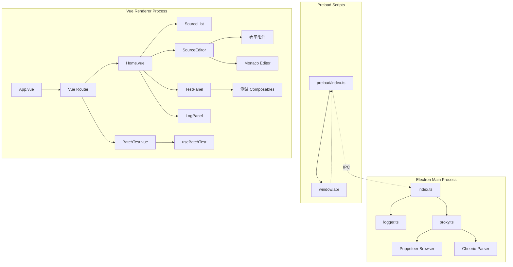
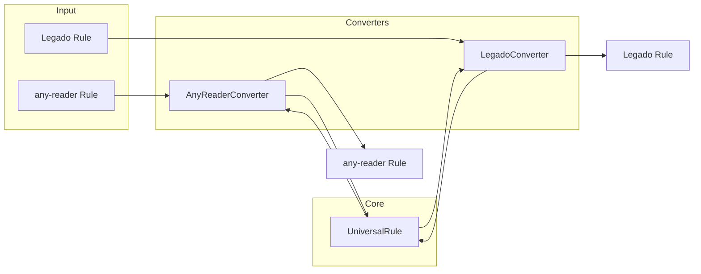
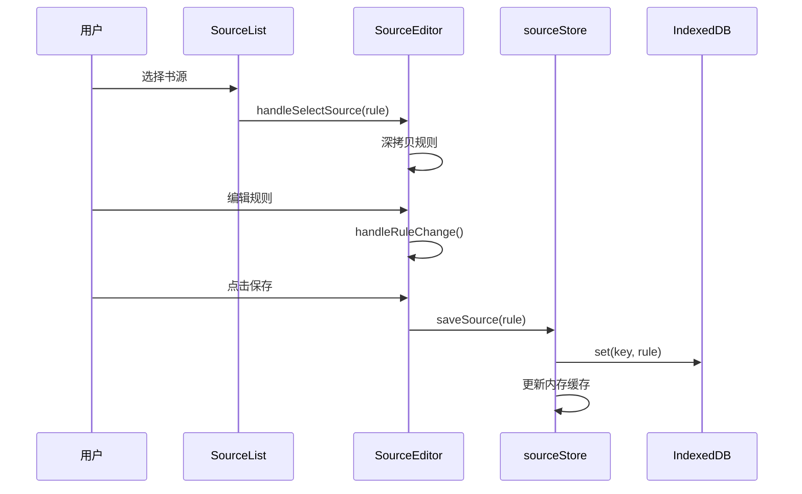
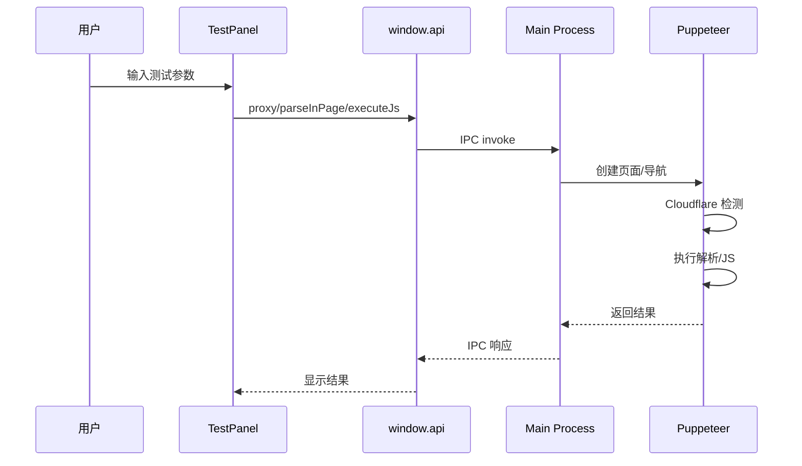
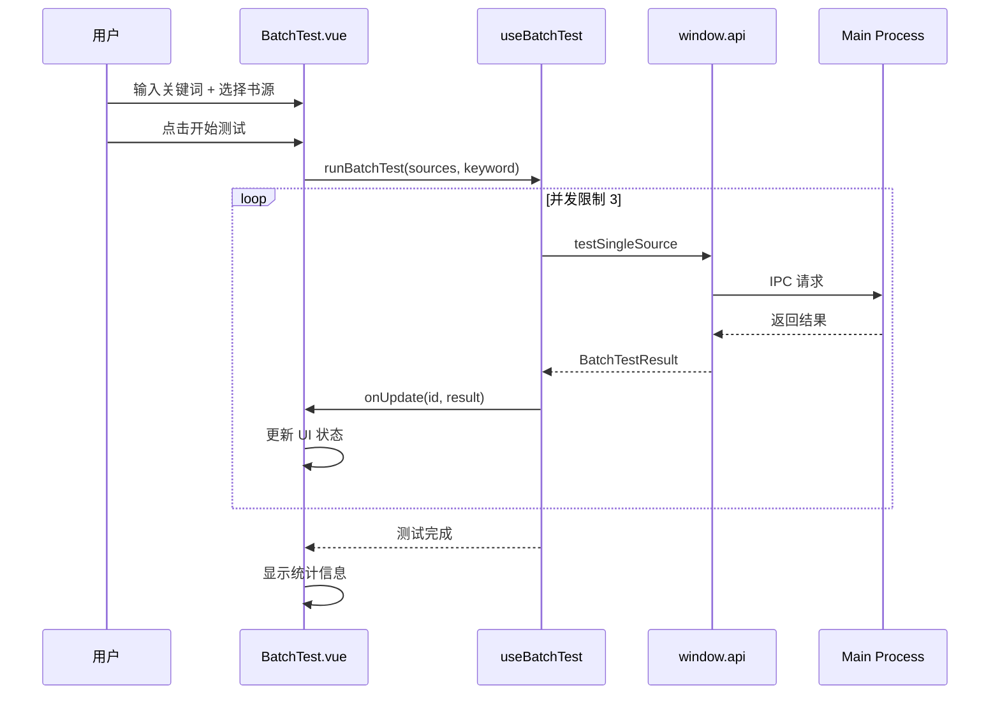

# Reader Source - 系统架构

## 架构概览

Reader Source 采用 Electron + Vue 3 的桌面应用架构，分为主进程、预加载脚本和渲染进程三层。



## 目录结构

```
docs/                              # 用户文档
├── rule-guide.md                  # 通用规则使用指南 (443行)
└── universal-rule-spec.md         # 通用规则规范设计方案 (335行)

scripts/                           # 开发测试脚本
├── README.md                      # 脚本使用说明 (282行)
├── test-conversion.ts             # 规则转换测试脚本 (405行)
└── test-roundtrip.ts              # 往返一致性测试脚本

test_rules/                        # 测试规则样例
├── anyReader/                     # any-reader 格式规则
│   ├── 17k小说.json
│   └── 腾讯漫画.json
├── legado/                        # Legado 格式规则
│   ├── 3A小说.json
│   └── UAA 文学.json
└── universal/                     # 通用格式规则
    └── 漫小肆韓漫.json

src/
├── main/                          # Electron 主进程
│   ├── index.ts                   # 主进程入口，窗口管理
│   ├── logger.ts                  # 日志记录模块
│   └── proxy.ts                   # 网络代理/解析模块 (913行)
│
├── preload/                       # 预加载脚本
│   ├── index.ts                   # 暴露 IPC API
│   └── index.d.ts                 # TypeScript 类型声明
│
└── renderer/src/                  # Vue 渲染进程
    ├── App.vue                    # 根组件（路由容器）
    ├── main.ts                    # 应用入口
    │
    ├── components/                # UI 组件
    │   ├── SourceList.vue         # 书源列表组件
    │   ├── LogPanel.vue           # 日志面板
    │   ├── MonacoEditor.vue       # Monaco 编辑器封装
    │   ├── Resizer.vue            # 面板分隔拖拽
    │   │
    │   ├── source-editor/         # 规则编辑器模块
    │   │   ├── SourceEditor.vue   # 编辑器主组件
    │   │   ├── EditorToolbar.vue  # 工具栏
    │   │   ├── PlatformConfigSection.vue  # 平台配置区
    │   │   └── forms/             # 规则表单组件
    │   │       ├── BasicInfoForm.vue      # 基本信息
    │   │       ├── SearchRuleForm.vue     # 搜索规则
    │   │       ├── ChapterRuleForm.vue    # 章节规则
    │   │       ├── DiscoverRuleForm.vue   # 发现规则
    │   │       ├── ContentRuleForm.vue    # 正文规则
    │   │       └── DetailRuleForm.vue     # 详情规则
    │   │
    │   └── test-panel/            # 测试面板模块
    │       ├── TestPanel.vue      # 测试面板主组件 (820行)
    │       ├── composables/       # 测试逻辑 Composables
    │       │   ├── index.ts
    │       │   ├── useTestLogic.ts
    │       │   ├── useSearchTest.ts
    │       │   ├── useChapterTest.ts
    │       │   ├── useContentTest.ts
    │       │   ├── useDiscoverTest.ts
    │       │   └── useBatchTest.ts        # 批量测试逻辑 (220行)
    │       ├── inputs/            # 测试输入组件
    │       │   ├── SearchInput.vue
    │       │   ├── ChapterInput.vue
    │       │   ├── ContentInput.vue
    │       │   └── DiscoverInput.vue
    │       └── results/           # 测试结果组件
    │           ├── ResultTabs.vue
    │           ├── SearchResultList.vue
    │           ├── ChapterResultList.vue
    │           ├── DiscoverResultList.vue
    │           └── ContentPreview.vue
    │
    ├── converters/                # 规则格式转换器
    │   ├── index.ts               # 转换器入口
    │   ├── base.ts                # 基础接口定义
    │   ├── any-reader.ts          # any-reader 转换器
    │   ├── legado.ts              # Legado 转换器
    │   ├── test-conversion.ts     # 转换器测试
    │   └── expression/            # 表达式转换
    │       ├── index.ts           # 表达式转换入口
    │       ├── parser.ts          # 表达式解析器
    │       ├── jsoup.ts           # JSOUP 语法转换
    │       ├── variables.ts       # 变量转换
    │       └── validator.ts       # 表达式验证器
    │
    ├── stores/                    # Pinia 状态管理
    │   ├── sourceStore.ts         # 书源状态管理
    │   └── logStore.ts            # 日志状态管理
    │
    ├── types/                     # TypeScript 类型定义
    │   ├── index.ts               # any-reader 规则类型
    │   ├── universal.ts           # 通用规则类型 (325行)
    │   ├── legado.ts              # Legado 规则类型
    │   ├── expression.ts          # 表达式类型
    │   └── guards.ts              # 类型守卫
    │
    ├── router/                    # Vue Router 配置
    │   └── index.ts               # 路由定义 (含 /batch-test)
    │
    └── views/                     # 页面视图
        ├── Home.vue               # 主页面 (604行)
        └── BatchTest.vue          # 批量测试页面 (492行)
```

## 核心模块详解

### 1. 主进程 - proxy.ts

网络代理和解析模块，提供以下 IPC 处理器：

| IPC 通道            | 功能          | 实现方式                |
| ------------------- | ------------- | ----------------------- |
| `proxy:fetch`       | HTTP 代理请求 | Puppeteer 无头浏览器    |
| `proxy:parse`       | HTML 解析     | Cheerio (服务端)        |
| `proxy:parseInPage` | 页面内解析    | Puppeteer + DOM API     |
| `proxy:executeJs`   | JS 规则执行   | Puppeteer page.evaluate |
| `proxy:image`       | 图片代理      | fetch + Base64 转换     |

**Cloudflare 处理**：

- 自动检测验证页面（标题/内容关键词）
- 等待重试机制（5秒间隔，最多6次）
- 支持 DEBUG_MODE 显示浏览器窗口

### 2. 类型系统

```typescript
// 类型层次结构
UniversalRule (通用规则 - 超集)
├── 基本信息: id, name, host, icon, author, group, sort
├── 内容类型: contentType (novel/manga/video/audio/rss)
├── 请求设置: userAgent, headers, loadJs
├── 规则配置
│   ├── search?: UniversalSearchRule
│   ├── detail?: UniversalDetailRule
│   ├── chapter?: UniversalChapterRule
│   ├── discover?: UniversalDiscoverRule
│   └── content?: UniversalContentRule
├── 平台特有字段
│   ├── anyReader?: AnyReaderBaseFields
│   └── legado?: LegadoBaseFields
└── 元数据: _meta (sourceFormat, version, timestamps)
```

### 3. 转换器架构



**转换器接口**：

```typescript
interface RuleConverter<T> {
  toUniversal(rule: T, options?: ConvertOptions): UniversalRule
  fromUniversal(rule: UniversalRule, options?: ConvertOptions): T
  validate(rule: T): ValidationResult
  detect(rule: unknown): rule is T
}
```

### 4. 状态管理 - sourceStore

```typescript
// 主要状态
sources: UniversalRule[]        // 所有规则（内存缓存）
currentSource: UniversalRule    // 当前选中规则
loading: boolean                // 加载状态
searchQuery: string             // 搜索关键词

// 核心方法
loadSources()                   // 从 IndexedDB 加载
saveSource(rule)                // 保存规则
deleteSource(id)                // 删除规则
importSources(json)             // 智能导入（自动检测格式）
exportSources(format)           // 批量导出
clearAllSources()               // 清空所有
```

**存储策略**：

- IndexedDB 键格式: `rule_{id}`
- 内存缓存 + IndexedDB 双层存储
- 按 sort 权重降序排列

### 5. 测试面板 Composables

采用 Vue 3 Composition API 组织测试逻辑：

```typescript
// useTestLogic.ts - 通用测试框架
function useTestLogic<TInput, TResult>({
  testFn, // 测试函数
  inputValidator, // 输入验证
  onSuccess, // 成功回调
  onError // 错误回调
})

// 具体测试 Composables
useSearchTest(rule) // 搜索测试
useChapterTest(rule) // 章节测试
useContentTest(rule) // 正文测试
useDiscoverTest(rule) // 发现测试
useBatchTest() // 批量测试（新增）
```

### 6. 批量测试模块（新增）

```typescript
// useBatchTest.ts - 批量测试 Composable
interface BatchTestResult {
  status: 'pending' | 'running' | 'success' | 'error'
  count: number // 结果数量
  error?: string // 错误信息
  duration?: number // 耗时（毫秒）
  visualData?: SearchResult[] // 可视化数据
  parsedResult?: unknown[] // 解析结果
  rawHtml?: string // 原始 HTML
}

function useBatchTest() {
  // 批量执行测试（并发限制为 3）
  async function runBatchTest(
    sources: UniversalRule[],
    keyword: string,
    onUpdate: (id: string, result: BatchTestResult) => void
  ): Promise<void>

  // 单书源测试
  async function testSingleSource(source: UniversalRule, keyword: string): Promise<BatchTestResult>
}
```

## 数据流

### 规则编辑流程



### 规则测试流程



### 批量测试流程（新增）



## 关键设计决策

### 1. 通用规则作为核心存储格式

- **原因**: 支持多格式无损转换
- **实现**: 所有导入规则转换为 UniversalRule 存储

### 2. 平台特有字段分组设计

- **原因**: 便于 UI 分类展示和转换处理
- **实现**: `anyReader` 和 `legado` 子对象内嵌

### 3. Puppeteer 作为网络解析引擎

- **原因**: 绕过 Cloudflare 等反爬机制
- **实现**: 共享浏览器实例，自动重试机制

### 4. 表达式统一前缀规范

- **原因**: 简化转换逻辑
- **实现**: 统一使用小写前缀 `@css:`, `@xpath:`, `@json:`, `@js:`

### 5. 批量测试并发控制

- **原因**: 避免同时打开过多 Puppeteer 页面导致资源耗尽
- **实现**: Promise 并发池，限制为 3 个并发任务
