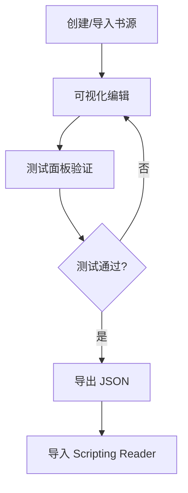

# Reader Source - 产品文档

## 产品愿景

为 iOS [Scripting](https://scripting.fun/) 阅读插件提供一个专业的书源规则编辑和管理工具，简化规则创建、测试的流程。

## 解决的问题

1. **编辑困难** - 手动编写 JSON 规则容易出错，缺乏可视化工具
2. **测试不便** - 规则编写后需要导入阅读器才能验证，效率低下
3. **学习成本** - 规则语法复杂，需要智能提示降低门槛

## 核心功能

### 1. 书源列表管理

- 导入/导出书源
- 批量管理和搜索过滤
- 本地持久化存储（IndexedDB）

### 2. 可视化规则编辑器

- 分类表单编辑：基本信息、搜索规则、章节规则、发现规则、正文规则、详情规则
- Monaco 代码编辑器支持（JSON/JavaScript）
- JSON Schema 智能提示与校验
- 实时验证和提示

### 3. 规则测试面板

- **搜索测试**：输入关键词，测试搜索规则
- **发现测试**：测试发现页规则和分页
- **章节测试**：输入书籍 URL，测试目录规则
- **正文测试**：输入章节 URL，测试内容规则
- 实时日志输出
- 结果预览（支持图片代理绕过防盗链）

### 4. 批量测试

- **多书源并发测试**：同时测试多个书源的搜索功能
- **并发控制**：限制同时进行的测试数（默认 3 个）
- **状态追踪**：实时显示每个书源的测试状态（等待/进行中/成功/失败）
- **统计汇总**：成功/失败数量、总结果数
- **详情查看**：点击书源查看完整测试结果

### 5. 网页解析能力

- Puppeteer 无头浏览器（绕过 Cloudflare 验证）
- Cheerio HTML 解析
- 支持 XPath 和 CSS 选择器
- JavaScript 规则执行
- 图片代理（绕过防盗链）

## 用户体验目标

1. **直观易用** - 表单化编辑，降低学习门槛
2. **即时反馈** - 测试面板实时验证规则正确性
3. **智能提示** - JSON Schema 提供自动补全和错误检测
4. **高效调试** - 日志面板记录详细执行过程

## 工作流程



## 支持的内容类型

| 类型 | 描述     | 说明                     |
| ---- | -------- | ------------------------ |
| 小说 | 文字内容 | novel - 支持文字章节阅读 |
| 漫画 | 图片内容 | manga - 支持图片章节阅读 |

## 界面布局

```
┌────────────────────────────────────────────────────────────┐
│ [工具栏] 新建 | 保存 | 导入 | 导出 | 清除         书源调试器 │
├──────────┬────────────────────────────┬────────────────────┤
│          │                            │                    │
│ 书源列表 │     规则编辑器              │    测试面板        │
│          │                            │                    │
│ - 搜索框 │ [基本信息] [搜索] [章节]...│ [搜索] [发现] ...  │
│ - 列表   │                            │                    │
│          │ 表单 / Monaco 编辑器       │ 输入 + 结果列表    │
│          │                            │                    │
├──────────┴────────────────────────────┴────────────────────┤
│ [日志面板]                                                  │
│ [INFO] 已加载书源「xxx」                                    │
│ [DEBUG] 请求 URL: https://...                              │
└────────────────────────────────────────────────────────────┘
```

## 目标用户画像

1. **Scripting 用户** - 需要自定义书源以访问特定网站内容
2. **书源开发者** - 为社区制作和维护书源规则
3. **社区维护者** - 管理和分发书源规则集合

## 规则格式

项目使用 Universal 格式作为唯一的规则格式，这是 Scripting Reader 插件的原生格式。

详细规范请参考：

- [`universal-rule-spec.md`](docs/universal-rule-spec.md) - 规则规范
- [`rule-guide.md`](docs/rule-guide.md) - 规则编写指南
- [`universal-rule-schema.json`](docs/universal-rule-schema.json) - JSON Schema
