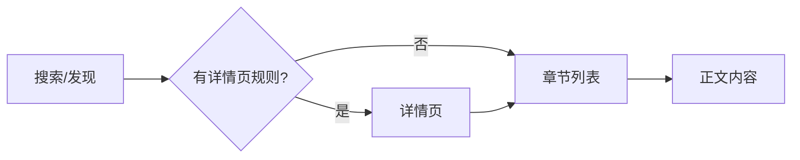

# 规则使用指南

本文档介绍如何编写书源规则来解析各类网站内容。

## 目录

- [规则执行流程](#规则执行流程)
- [规则结构概览](#规则结构概览)
- [基本信息](#基本信息)
- [规则表达式语法](#规则表达式语法)
- [搜索规则](#搜索规则)
- [发现页规则](#发现页规则)
- [章节规则](#章节规则)
- [正文规则](#正文规则)
- [详情页规则](#详情页规则)
- [高级技巧](#高级技巧)
- [规则示例](#规则示例)
- [调试指南](#调试指南)

---

## 规则执行流程

规则引擎按以下流程执行：



1. **搜索/发现** → 获取书籍列表，提取书名、封面、作者、URL 等
2. **详情页** (可选) → 获取书籍详细信息，提取目录 URL
3. **章节列表** → 获取章节列表，提取章节名、URL
4. **正文内容** → 获取章节正文或图片列表

> 每个阶段的 `result` 字段值将作为下一阶段的输入 URL。

---

## 规则结构概览

通用规则是一个 JSON 对象，包含以下主要模块：

```json
{
  "id": "唯一标识",
  "name": "规则名称",
  "host": "https://example.com",
  "contentType": "novel",
  "enabled": true,

  "search": {
    /* 搜索规则 */
  },
  "discover": {
    /* 发现页规则 */
  },
  "chapter": {
    /* 章节规则 */
  },
  "content": {
    /* 正文规则 */
  },
  "detail": {
    /* 详情页规则 (可选) */
  }
}
```

### 内容类型 (contentType)

| 类型    | 说明      | 正文呈现   |
| ------- | --------- | ---------- |
| `novel` | 小说/文字 | 文本阅读器 |
| `manga` | 漫画/图片 | 图片列表   |

---

## 基本信息

| 字段          | 类型                     | 必填 | 说明                                     |
| ------------- | ------------------------ | :--: | ---------------------------------------- |
| `id`          | string                   |  ✓   | 唯一标识 (UUID)                          |
| `name`        | string                   |  ✓   | 规则名称                                 |
| `host`        | string                   |  ✓   | 网站域名，如 `https://example.com`       |
| `contentType` | string                   |  ✓   | 内容类型 (见上表)                        |
| `enabled`     | boolean                  |      | 是否启用 (默认 `true`)                   |
| `icon`        | string                   |      | 图标 URL                                 |
| `author`      | string                   |      | 规则作者                                 |
| `group`       | string                   |      | 分组名称                                 |
| `comment`     | string                   |      | 规则备注说明                             |
| `sort`        | number                   |      | 排序权重 (越高越靠前)                    |
| `userAgent`   | string                   |      | 自定义 User-Agent                        |
| `headers`     | `Record<string, string>` |      | 自定义请求头                             |
| `jsLib`       | string                   |      | JS 函数库 (可在所有 @js: 规则中调用)     |
| `loadJs`      | string                   |      | 全局 JS 脚本 (页面加载时执行，用于注入） |

---

## 规则表达式语法

规则表达式用于从网页或 API 响应中提取数据。

### 规则类型

| 类型       | 前缀        | 自动识别           | 说明                   |
| ---------- | ----------- | ------------------ | ---------------------- |
| CSS        | `@css:`     | 默认               | 标准 CSS 选择器        |
| XPath      | `@xpath:`   | `//` 或 `/` 开头   | XPath 表达式           |
| JSONPath   | `@json:`    | `$.` 或 `$[` 开头  | JSON 路径表达式        |
| JavaScript | `@js:`      | -                  | JavaScript 代码        |
| 正则过滤   | `@filter:`  | -                  | 正则表达式过滤         |
| 正则替换   | `@replace:` | -                  | 正则表达式替换         |
| 字面量     | 无前缀      | 不匹配上述任何格式 | 直接使用的字符串或选择 |

> 规则类型可自动识别，但建议使用显式前缀以提高可读性。

---

### CSS 选择器

以 `@css:` 开头（可省略），使用标准 CSS 选择器语法。

#### 基本格式

```
@css:选择器@属性
```

| 格式               | 说明                             |
| ------------------ | -------------------------------- |
| `.class`           | 选择元素，默认取 `text`          |
| `.class@text`      | 获取文本内容 (textContent)       |
| `.class@html`      | 获取内部 HTML (innerHTML)        |
| `.class@outerHtml` | 获取外部 HTML (outerHTML)        |
| `.class@href`      | 获取 `href` 属性                 |
| `.class@src`       | 获取 `src` 属性                  |
| `.class@data-xxx`  | 获取自定义属性                   |
| `@text`            | 无选择器，直接获取当前元素的文本 |
| `text`             | **简写形式**，等同于 `@text`     |
| `href`             | **简写形式**，等同于 `@href`     |
| `src`              | **简写形式**，等同于 `@src`      |

#### 示例

```
@css:.book-list li
.title@text
img.cover@src
.lazy@data-original
a.link@href

# 简写形式（在列表项内使用）
text           # 等同于 @text，获取当前元素文本
href           # 等同于 @href，获取当前元素的 href 属性
src            # 等同于 @src，获取当前元素的 src 属性
```

> **提示**：
>
> - 省略 `@属性` 时默认获取元素本身或 `text`。
> - 支持 `text`、`href`、`src` 三个简写关键词，可直接作为字段规则使用。

---

### XPath

以 `@xpath:` 开头，或以 `//`、`/` 开头（自动识别）。

```
@xpath://div[@class="content"]/text()
@xpath://*[@id="chapter-list"]/li
//div[@class="item"]/a/@href
```

---

### JSONPath

以 `@json:` 开头，或以 `$.`、`$[` 开头（自动识别）。用于解析 JSON 数据。

```
@json:$.data.list
@json:$.data.list[0].title
@json:$..name
$.data[*].url
```

#### 支持的语法

| 语法         | 说明                        |
| ------------ | --------------------------- |
| `$.field`    | 获取对象的 field 属性       |
| `$.a.b.c`    | 链式访问嵌套属性            |
| `$[0]`       | 获取数组第一个元素          |
| `$.list[0]`  | 获取 list 数组的第一个元素  |
| `$.list[:5]` | 获取 list 数组的前 5 个元素 |
| `$..field`   | 递归搜索所有 field          |
| `$[*].field` | 获取数组每个元素的 field    |

---

### JavaScript

以 `@js:` 开头，可执行 JavaScript 代码。

```
@js:result.data.list
@js:result.match(/url:'([^']+)'/)[1]
@js:JSON.parse(result).data.map(i => i.url)
```

#### 可用变量

| 变量         | 说明                                           |
| ------------ | ---------------------------------------------- |
| `result`     | 当前阶段的响应结果（HTML 字符串或上一步返回值) |
| `lastResult` | 上一阶段的结果                                 |
| `$host`      | 规则的 `host` 值                               |
| `keyword`    | 搜索关键词（仅搜索阶段）                       |
| `page`       | 当前页码                                       |

#### 内置工具

| 工具       | 说明                              |
| ---------- | --------------------------------- |
| `CryptoJS` | 加解密库 (需 `useCryptoJS: true`) |
| `fetch`    | 网络请求                          |
| `cheerio`  | HTML 解析 (服务端)                |

#### 异步代码

```javascript
@js:(async () => {
  const res = await fetch('https://api.example.com/data');
  const data = await res.json();
  return data.list;
})()
```

#### 级联规则

可在 `@js:` 后接 `@json:` 实现级联处理：

```
@js:result.match(/data = (\[.*?\]);/)[1]@json:$[*].url
```

执行流程：

1. 执行 JS 代码提取 JSON 字符串
2. 使用 JSONPath 进一步提取数据

---

### 正则替换 (##)

使用 `##` 进行正则匹配替换，可附加在任何规则后面。

#### 格式

```
规则##正则模式##替换内容
```

| 格式                     | 说明                     |
| ------------------------ | ------------------------ |
| `规则##pattern`          | 删除匹配内容（替换为空） |
| `规则##pattern##replace` | 将匹配内容替换为 replace |

#### 示例

```
.url@href##\.html$##.shtml
.content@html##<br\s*/?>##\n
$.title##</?em>##
@css:.price@text##[^\d.]##
```

---

### 组合操作符

| 操作符 | 说明                           | 示例                  |
| ------ | ------------------------------ | --------------------- |
| `\|\|` | 或逻辑，第一个为空则使用第二个 | `$.a \|\| $.b`        |
| `&&`   | 与逻辑，结果合并               | `$.a && $.b`          |
| `{{}}` | 变量模板                       | `http://xxx/{{$.id}}` |

---

### URL 模板变量

用于搜索 URL 和发现 URL 中的动态变量替换。

| 变量                   | 说明             |
| ---------------------- | ---------------- |
| `$keyword` / `{{key}}` | 搜索关键词       |
| `$page` / `{{page}}`   | 页码 (从 1 开始) |
| `$host` / `{{host}}`   | 规则 host        |

---

## 搜索规则

用于实现搜索功能，从搜索结果页提取书籍/内容列表。

### 字段说明

| 字段            | 类型    | 必填 | 说明                           |
| --------------- | ------- | :--: | ------------------------------ |
| `enabled`       | boolean |  ✓   | 是否启用搜索                   |
| `url`           | string  |  ✓   | 搜索 URL 模板                  |
| `list`          | string  |  ✓   | 结果列表选择器                 |
| `name`          | string  |  ✓   | 书名选择器                     |
| `result`        | string  |  ✓   | 结果 URL 选择器（详情/章节页） |
| `cover`         | string  |      | 封面图选择器                   |
| `author`        | string  |      | 作者选择器                     |
| `description`   | string  |      | 描述/简介选择器                |
| `latestChapter` | string  |      | 最新章节选择器                 |
| `tags`          | string  |      | 标签/分类选择器                |
| `wordCount`     | string  |      | 字数选择器                     |

### 执行流程

1. 将 `url` 中的变量（`$keyword`、`$page`）替换为实际值
2. 请求 URL 获取响应
3. 使用 `list` 选择器定位每个结果项
4. 在每个结果项内，使用各字段选择器提取数据
5. `result` 提取的 URL 将作为下一阶段的输入

### 示例

```json
{
  "search": {
    "enabled": true,
    "url": "https://example.com/search?keyword=$keyword&page=$page",
    "list": ".search-result .book-item",
    "name": ".book-name@text",
    "author": ".book-author@text",
    "cover": ".book-cover img@src",
    "description": ".book-desc@text",
    "latestChapter": ".latest-chapter@text",
    "result": ".book-name a@href"
  }
}
```

---

## 发现页规则

用于实现发现/分类浏览功能，展示分类列表和内容。

### 字段说明

| 字段            | 类型    | 必填 | 说明                  |
| --------------- | ------- | :--: | --------------------- |
| `enabled`       | boolean |  ✓   | 是否启用发现页        |
| `url`           | string  |  ✓   | 发现页 URL 或分类配置 |
| `list`          | string  |  ✓   | 结果列表选择器        |
| `name`          | string  |  ✓   | 书名选择器            |
| `result`        | string  |  ✓   | 结果 URL 选择器       |
| `cover`         | string  |      | 封面图选择器          |
| `author`        | string  |      | 作者选择器            |
| `description`   | string  |      | 描述选择器            |
| `latestChapter` | string  |      | 最新章节选择器        |
| `wordCount`     | string  |      | 字数选择器            |
| `nextUrl`       | string  |      | 下一页 URL 选择器     |

### 分类 URL 格式

#### 静态分类

每行一个分类，格式为 `分类名::URL`：

```
热门推荐::/hot/
最新更新::/new/$page.html
完结小说::/finish/$page.html
```

#### 分组分类

使用三段式 `分组名::分类名::URL`：

```
榜单::热门榜::/rank/hot/$page.html
榜单::收藏榜::/rank/fav/$page.html
分类::玄幻::/category/xuanhuan/$page.html
分类::都市::/category/dushi/$page.html
```

#### 动态生成

使用 `@js:` 动态生成分类：

```javascript
@js:(() => {
  const types = [
    { name: '玄幻', id: 1 },
    { name: '都市', id: 2 },
    { name: '历史', id: 3 }
  ];
  return types.map(t => `${t.name}::/list/${t.id}/$page.html`);
})();
```

或返回对象数组（自动转换）：

```javascript
@js:(() => {
  return [
    { title: '热门', url: '/hot/$page.html' },
    { title: '最新', url: '/new/$page.html' }
  ];
})();
```

### 示例

```json
{
  "discover": {
    "enabled": true,
    "url": "热门::/top/\n最新::/new/\n完结::/finish/",
    "list": ".book-list .item",
    "name": ".title@text",
    "cover": ".cover img@data-src",
    "author": ".author@text",
    "result": "a@href",
    "nextUrl": ".pagination .next@href"
  }
}
```

---

## 章节规则

用于从详情页或章节列表页获取章节目录。

### 字段说明

| 字段      | 类型   | 必填 | 说明                                   |
| --------- | ------ | :--: | -------------------------------------- |
| `url`     | string |      | 章节列表 URL（可从上一步 result 获取） |
| `list`    | string |  ✓   | 章节列表选择器                         |
| `name`    | string |  ✓   | 章节名选择器                           |
| `result`  | string |  ✓   | 章节 URL 选择器（正文页地址）          |
| `cover`   | string |      | 封面选择器（用于更新封面）             |
| `time`    | string |      | 更新时间选择器                         |
| `nextUrl` | string |      | 下一页 URL 选择器（分页章节列表）      |
| `isVip`   | string |      | VIP 章节标识选择器                     |
| `isPay`   | string |      | 付费章节标识选择器                     |

### 执行流程

1. 使用上一阶段的 `result` URL 请求页面
2. 使用 `list` 定位所有章节项
3. 在每个章节项内提取 `name` 和 `result`
4. 如有 `nextUrl` 且匹配到内容，继续请求下一页

### 示例

```json
{
  "chapter": {
    "list": "#chapter-list li",
    "name": "a@text",
    "result": "a@href",
    "time": ".update-time@text",
    "nextUrl": ".page-next@href"
  }
}
```

#### 简写形式

当章节项本身就是 `<a>` 标签时：

```json
{
  "chapter": {
    "list": ".chapter-list a",
    "name": "@text",
    "result": "@href"
  }
}
```

---

## 正文规则

用于提取文章/章节的正文内容。

### 字段说明

| 字段           | 类型                   | 必填 | 说明                                 |
| -------------- | ---------------------- | :--: | ------------------------------------ |
| `url`          | string                 |      | 正文页 URL（可从上一步 result 获取） |
| `items`        | string                 |  ✓   | 内容选择器                           |
| `nextUrl`      | string                 |      | 下一页 URL（分页正文）               |
| `decoder`      | string                 |      | 解密器脚本                           |
| `imageHeaders` | string                 |      | 图片请求头（漫画类源）               |
| `webView`      | boolean                |      | 是否使用 WebView 加载                |
| `replaceRules` | `ContentReplaceRule[]` |      | 正文净化替换规则                     |

### 内容类型示例

#### 小说正文

```json
{
  "content": {
    "items": "#content@text"
  }
}
```

获取多个段落（每个段落一行）：

```json
{
  "content": {
    "items": "#content p@text"
  }
}
```

#### 漫画图片

从页面变量提取：

```json
{
  "content": {
    "items": "@js:result.match(/images\\s*=\\s*(\\[.*?\\]);/s)[1]@json:$[*]"
  }
}
```

从 API 获取：

```json
{
  "content": {
    "items": "@js:(async () => {\n  const id = result.match(/id=(\\d+)/)[1];\n  const res = await fetch(`https://api.example.com/chapter/${id}`);\n  const data = await res.json();\n  return data.images;\n})()"
  }
}
```

#### 视频链接

```json
{
  "content": {
    "items": "@js:result.match(/source:\\s*'([^']+)'/)[1]"
  }
}
```

### 正文净化 (replaceRules)

用于清理正文中的广告或无关内容：

```json
{
  "content": {
    "items": "#content@html",
    "replaceRules": [
      { "pattern": "<div class=\"ad\">.*?</div>", "isRegex": true, "replacement": "" },
      { "pattern": "本章未完，请翻页", "replacement": "" }
    ]
  }
}
```

---

## 详情页规则

详情页是可选流程，用于在进入章节列表前获取更多书籍信息。

> **适用场景**：搜索结果不包含完整信息，需要单独请求详情页获取。

### 字段说明

| 字段            | 类型    | 说明                  |
| --------------- | ------- | --------------------- |
| `enabled`       | boolean | 是否启用详情页        |
| `init`          | string  | 预处理规则            |
| `name`          | string  | 书名选择器            |
| `author`        | string  | 作者选择器            |
| `cover`         | string  | 封面选择器            |
| `description`   | string  | 简介选择器            |
| `latestChapter` | string  | 最新章节选择器        |
| `wordCount`     | string  | 字数选择器            |
| `tags`          | string  | 分类标签选择器        |
| `tocUrl`        | string  | 目录页 URL 选择器     |
| `canRename`     | boolean | 允许用户修改书名/作者 |

### 示例

```json
{
  "detail": {
    "enabled": true,
    "name": ".book-info h1@text",
    "author": ".book-info .author@text",
    "cover": ".book-cover img@src",
    "description": ".book-intro@text",
    "latestChapter": ".latest-chapter@text",
    "tags": ".book-tags span@text",
    "tocUrl": ".read-btn@href"
  }
}
```

---

## 高级技巧

### 处理动态加载内容

对于 JavaScript 渲染的页面，使用 `@js:` 规则等待内容加载：

```javascript
@js:(async () => {
  // 等待元素出现
  for (let i = 0; i < 10; i++) {
    if (document.querySelector('.book-list')) break;
    await new Promise(r => setTimeout(r, 500));
  }
  return document.body.innerHTML;
})()
```

### 处理加密内容

使用 CryptoJS 解密：

```javascript
@js:(() => {
  const encrypted = result.match(/content\s*=\s*"([^"]+)"/)[1];
  const key = CryptoJS.enc.Utf8.parse('secret-key-here');
  const decrypted = CryptoJS.AES.decrypt(encrypted, key);
  return decrypted.toString(CryptoJS.enc.Utf8);
})()
```

> 需在规则中设置 `anyReader.useCryptoJS: true`

### 多页内容合并

正文分页时，使用 `nextUrl` 自动加载下一页：

```json
{
  "content": {
    "items": "#content@text",
    "nextUrl": ".page-next@href"
  }
}
```

### 请求头设置

某些网站需要特定请求头：

```json
{
  "headers": {
    "Referer": "https://example.com/",
    "X-Requested-With": "XMLHttpRequest"
  },
  "userAgent": "Mozilla/5.0 ..."
}
```

---

## 规则示例

### 完整小说站规则

```json
{
  "id": "example-novel-site",
  "name": "示例小说站",
  "host": "https://www.example.com",
  "contentType": "novel",
  "enabled": true,
  "author": "作者名",
  "group": "小说",

  "search": {
    "enabled": true,
    "url": "https://www.example.com/search?keyword=$keyword&page=$page",
    "list": ".search-list .book-item",
    "name": ".book-name@text",
    "author": ".book-author@text",
    "cover": ".book-cover img@src",
    "description": ".book-desc@text##\\s+##",
    "latestChapter": ".latest-chapter@text",
    "result": ".book-name a@href"
  },

  "discover": {
    "enabled": true,
    "url": "热门推荐::/top/$page.html\n最新更新::/new/$page.html\n已完结::/finish/$page.html",
    "list": ".book-list .item",
    "name": ".title@text",
    "cover": ".cover img@data-src",
    "author": ".author@text",
    "result": "a@href",
    "nextUrl": ".page .next@href"
  },

  "chapter": {
    "list": "#chapter-list li",
    "name": "a@text",
    "result": "a@href",
    "time": ".update-time@text"
  },

  "content": {
    "items": "#content@text",
    "replaceRules": [{ "pattern": "广告内容", "replacement": "" }]
  }
}
```

### 完整漫画站规则

```json
{
  "id": "example-manga-site",
  "name": "示例漫画站",
  "host": "https://manga.example.com",
  "contentType": "manga",
  "enabled": true,

  "discover": {
    "enabled": true,
    "url": "@js:(() => {\n  const types = ['热门', '更新', '完结'];\n  return types.map(t => `${t}::/list/${t}/$page.html`);\n})();",
    "list": ".manga-list .item",
    "name": ".title@text",
    "cover": "img@data-src",
    "author": ".author@text",
    "result": "a@href"
  },

  "chapter": {
    "list": ".chapter-list a",
    "name": "@text",
    "result": "@href"
  },

  "content": {
    "items": "@js:(async () => {\n  const data = result.match(/DATA\\s*=\\s*'([^']+)'/)[1];\n  const json = JSON.parse(atob(data));\n  return json.images;\n})()",
    "imageHeaders": "{ \"Referer\": \"https://manga.example.com/\" }"
  }
}
```

---

## 调试指南

### 使用书源编辑器

1. 在左侧面板编辑规则
2. 点击「测试」按钮打开测试面板
3. 选择测试类型（搜索/发现/章节/正文）
4. 查看「解析结果」和「原始数据」对比

### 使用浏览器开发者工具

1. **Elements 面板** - 测试 CSS 选择器
   - 使用 `$('选择器')` 或 `$$('选择器')` 验证
2. **Console 面板** - 测试 JavaScript 表达式
3. **Network 面板** - 查看 API 请求和响应

### 调试步骤

1. **验证 URL** - 确保搜索/发现 URL 能正确访问
2. **验证列表选择器** - 确认 `list` 能选中目标元素
3. **验证字段选择器** - 逐一验证各字段规则
4. **检查 URL 拼接** - 确保 `result` 返回完整或可拼接的 URL

### 常见问题

| 问题         | 可能原因                 | 解决方案                  |
| ------------ | ------------------------ | ------------------------- |
| 列表为空     | 选择器错误或内容动态加载 | 检查选择器/使用 @js:      |
| 图片加载失败 | 缺少 Referer 或防盗链    | 设置 `imageHeaders`       |
| 下一页失效   | URL拼接错误              | 检查 `nextUrl` 返回值     |
| 正文乱码     | 编码问题或需要解密       | 使用 `decoder`            |
| 搜索无结果   | 关键词编码问题           | URL 需 encodeURIComponent |

---

## 参考资料

- [CSS 选择器参考](https://developer.mozilla.org/zh-CN/docs/Web/CSS/CSS_Selectors)
- [XPath 教程](https://developer.mozilla.org/zh-CN/docs/Web/XPath)
- [JSONPath 文档](https://github.com/JSONPath-Plus/JSONPath)
- [规则规范](./universal-rule-spec.md)
