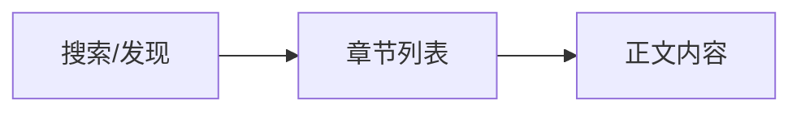

# 规则使用指南

本文档介绍如何编写书源规则来解析各类网站内容。

> **提示**：字段定义与类型规范详见 [规则规范设计方案](./universal-rule-spec.md)。

---

## 目录

- [规则执行流程](#规则执行流程)
- [规则结构概览](#规则结构概览)
- [规则表达式语法](#规则表达式语法)
- [搜索规则](#搜索规则)
- [发现页规则](#发现页规则)
- [章节规则](#章节规则)
- [正文规则](#正文规则)
- [高级技巧](#高级技巧)
- [完整示例](#完整示例)
- [调试指南](#调试指南)

---

## 规则执行流程

规则引擎按以下流程执行：



1. **搜索/发现** → 获取书籍列表，提取书名、封面、作者、`result` URL
2. **章节列表** → 获取章节列表，提取章节名、`result` URL
3. **正文内容** → 获取章节正文或图片列表

> **关键**：每个阶段的 `result` 字段值将作为下一阶段的输入 URL。

---

## 规则结构概览

通用规则是一个 JSON 对象：

```json
{
  "id": "unique-uuid",
  "name": "规则名称",
  "host": "https://example.com",
  "contentType": "novel",
  "enabled": true,

  "search": {
    /* 搜索规则 */
  },
  "discover": {
    /* 发现页规则 */
  },
  "chapter": {
    /* 章节规则 */
  },
  "content": {
    /* 正文规则 */
  }
}
```

### 内容类型

| 类型    | 说明      | 正文呈现   |
| ------- | --------- | ---------- |
| `novel` | 小说/文字 | 文本阅读器 |
| `manga` | 漫画/图片 | 图片列表   |

### 基本信息字段

| 字段          | 类型    | 必填 | 说明                       |
| ------------- | ------- | :--: | -------------------------- |
| `id`          | string  |  ✓   | 唯一标识 (UUID)            |
| `name`        | string  |  ✓   | 规则名称                   |
| `host`        | string  |  ✓   | 网站域名                   |
| `contentType` | string  |  ✓   | 内容类型 (`novel`/`manga`) |
| `enabled`     | boolean |      | 是否启用 (默认 `true`)     |
| `icon`        | string  |      | 图标 URL                   |
| `author`      | string  |      | 规则作者                   |
| `group`       | string  |      | 分组名称                   |
| `comment`     | string  |      | 规则备注                   |
| `sort`        | number  |      | 排序权重 (越高越靠前)      |
| `userAgent`   | string  |      | 自定义 User-Agent          |

---

## 规则表达式语法

规则表达式用于从网页或 API 响应中提取数据。

### 选择器类型

| 类型     | 前缀/识别              | 说明            |
| -------- | ---------------------- | --------------- |
| CSS      | 默认 / `@css:`         | 标准 CSS 选择器 |
| XPath    | `//` 或 `/` 开头       | XPath 表达式    |
| JSONPath | `$.` / `$[` / `@json:` | JSON 路径表达式 |
| JS       | `@js:`                 | JavaScript 代码 |

> 规则类型可自动识别，但建议使用显式前缀以提高可读性。

---

### CSS 选择器

格式：`选择器@属性`

| 格式               | 说明                        |
| ------------------ | --------------------------- |
| `.class`           | 选择元素，默认取 `text`     |
| `.class@text`      | 获取文本内容                |
| `.class@html`      | 获取 innerHTML              |
| `.class@outerHtml` | 获取 outerHTML              |
| `.class@href`      | 获取 `href` 属性            |
| `.class@src`       | 获取 `src` 属性             |
| `.class@data-xxx`  | 获取自定义 data 属性        |
| `text`             | **简写**，获取当前元素文本  |
| `href`             | **简写**，获取当前元素 href |
| `src`              | **简写**，获取当前元素 src  |

**示例**：

```
# 基本选择器
.book-list li              # 列表选择器
.title@text                # 获取文本
.title@html                # 获取 innerHTML
.title@outerHtml           # 获取 outerHTML（含标签本身）
img.cover@src              # 获取图片 src
.lazy@data-original        # 获取 data-original 属性
a.link@href                # 获取链接

# 简写形式（在列表项内使用）
text                       # 等同于 @text
href                       # 等同于 @href
src                        # 等同于 @src
```

---

### XPath

以 `//` 或 `/` 开头时自动识别，在服务端会转换为 CSS 选择器执行。

```
//div[@class="content"]/text()
//*[@id="chapter-list"]/li
//div[@class="item"]/a/@href
```

支持的 XPath 语法：

| XPath                 | 转换结果            |
| --------------------- | ------------------- |
| `//*[@class="xxx"]`   | `.xxx`              |
| `//div[@class="xxx"]` | `div.xxx`           |
| `//div/section/ul/li` | `div section ul li` |
| `li[position()>1]`    | `li:nth-child(n+2)` |
| `li[last()]`          | `li:last-child`     |
| `li[1]`               | `li:nth-child(1)`   |

---

### JSONPath

以 `$.`、`$[` 开头或使用 `@json:` 前缀时启用。用于解析 JSON API 响应。

**示例**：

```
# 基本用法
@json:$.data.list          # 使用 @json: 前缀
$.data.list[0].title       # 获取第一个元素的 title

# 数组操作
$[0]                       # 数组第一个元素
$.list[:5]                 # 数组前 5 个元素（切片）
$[*].field                 # 数组每个元素的 field

# 递归搜索
$..name                    # 递归搜索所有 name 字段
$.data..url                # 在 data 下递归搜索所有 url
```

**支持的语法**：

| 语法         | 说明                        |
| ------------ | --------------------------- |
| `$.field`    | 获取对象的 field 属性       |
| `$.a.b.c`    | 链式访问嵌套属性            |
| `$[0]`       | 获取数组第一个元素          |
| `$.list[0]`  | 获取 list 数组的第一个元素  |
| `$.list[:5]` | 获取 list 数组的前 5 个元素 |
| `$..field`   | 递归搜索所有 field          |
| `$[*].field` | 获取数组每个元素的 field    |

---

### JavaScript

以 `@js:` 开头，代码在浏览器上下文中执行。

```javascript
@js:result.data.list
@js:result.match(/url:'([^']+)'/)[1]
@js:JSON.parse(result).data.map(i => i.url)
```

**可用变量**：

| 变量         | 说明                             |
| ------------ | -------------------------------- |
| `result`     | 当前阶段的响应内容 (HTML 字符串) |
| `lastResult` | 上一阶段的结果                   |
| `$host`      | 规则的 `host` 值                 |
| `keyword`    | 搜索关键词 (仅搜索阶段)          |
| `page`       | 当前页码                         |

**异步代码**：

```javascript
@js:(async () => {
  const res = await fetch('https://api.example.com/data');
  const data = await res.json();
  return data.list;
})()
```

**内置工具**：

在 `@js:` 规则中可使用以下内置对象：

| 对象       | 说明           |
| ---------- | -------------- |
| `fetch`    | 标准 Fetch API |
| `CryptoJS` | 加密解密库     |
| `cheerio`  | HTML 解析库    |

**级联规则**：

可在 `@js:` 后接 `@json:` 实现级联处理：

```
@js:result.match(/data = (\[.*?\]);/)[1]@json:$[*].url
```

执行流程：JS 提取 JSON 字符串 → JSONPath 提取数据

---

### 正则替换 (##)

使用 `##` 进行正则匹配替换，可附加在任何规则后面。

**格式**：

```
规则##正则模式##替换内容
规则##正则模式          # 删除匹配内容（替换为空）
```

**示例**：

```
# 替换匹配内容
.url@href##\.html$##.shtml       # 将 .html 替换为 .shtml
.content@html##<br\s*/?>\n##\n   # 将 <br> 标签替换为换行符

# 删除匹配内容（替换为空）
$.title##</?em>                  # 删除 <em> 和 </em> 标签
.price@text##[^\d.]              # 删除非数字和小数点的字符
.desc@text##\s+##                # 删除所有空白字符（注意两个##结尾也可以）
```

---

### URL 模板变量

| 变量                       | 说明                         | 适用阶段       |
| -------------------------- | ---------------------------- | -------------- |
| `$keyword` / `{{keyword}}` | 搜索关键词                   | 搜索           |
| `$page` / `{{page}}`       | 页码 (从 1 开始)             | 搜索/发现/章节 |
| `$result` / `{{result}}`   | 上一步 `result` 字段返回的值 | 章节/正文      |
| `$host` / `{{host}}`       | 规则 host                    | 全部           |

#### 搜索/发现 URL 示例

```
# 搜索 URL
https://example.com/search?q=$keyword&p=$page

# 发现分类 URL
热门::/top/$page.html
最新::/new/{{page}}.html
```

#### `$result` 变量使用

`$result` 用于将上一阶段的结果传递到下一阶段的 URL 中。

**流程**：搜索 `result` → 章节 `url` → 正文 `url`

**场景 1**：搜索返回书籍 ID，需要拼接成章节列表 URL

```json
{
  "search": {
    "list": ".book-item",
    "result": ".book-id@text"
  },
  "chapter": {
    "url": "https://example.com/book/$result/chapters",
    "list": ".chapter-list li",
    "result": "a@href"
  }
}
```

搜索 `result` 返回 `"12345"` → 章节请求 `https://example.com/book/12345/chapters`

**场景 2**：章节返回章节 ID，需要拼接成正文 URL

```json
{
  "chapter": {
    "list": ".chapter-list a",
    "result": "@data-chapter-id"
  },
  "content": {
    "url": "https://example.com/read/{{result}}.html",
    "items": "#content@text"
  }
}
```

章节 `result` 返回 `"ch_001"` → 正文请求 `https://example.com/read/ch_001.html`

**场景 3**：不填 `url` 字段，直接使用上一步的完整 URL

```json
{
  "search": {
    "result": "a@href"
  },
  "chapter": {
    "list": ".chapter-list li",
    "result": "a@href"
  }
}
```

搜索 `result` 返回完整 URL `"https://example.com/book/12345"` → 章节直接请求该 URL

#### 相对 URL 自动补全

提取的 URL 如果是相对路径，会自动与 `host` 拼接：

| 提取结果                 | host                  | 最终 URL                                 |
| ------------------------ | --------------------- | ---------------------------------------- |
| `/book/123`              | `https://example.com` | `https://example.com/book/123`           |
| `chapter/1.html`         | `https://example.com` | `https://example.com/chapter/1.html`     |
| `//cdn.example.com/img`  | `https://example.com` | `https://cdn.example.com/img`            |
| `https://other.com/book` | `https://example.com` | `https://other.com/book` (完整 URL 不变) |

> **协议相对 URL**：以 `//` 开头的 URL 会自动补全协议（http 或 https），根据 host 的协议决定。

---

## 搜索规则

用于实现搜索功能，从搜索结果页提取书籍列表。

### 字段说明

| 字段            | 类型    | 必填 | 说明            |
| --------------- | ------- | :--: | --------------- |
| `enabled`       | boolean |  ✓   | 是否启用搜索    |
| `url`           | string  |  ✓   | 搜索 URL 模板   |
| `list`          | string  |  ✓   | 结果列表选择器  |
| `name`          | string  |  ✓   | 书名选择器      |
| `result`        | string  |  ✓   | 结果 URL 选择器 |
| `cover`         | string  |      | 封面图选择器    |
| `author`        | string  |      | 作者选择器      |
| `description`   | string  |      | 描述选择器      |
| `latestChapter` | string  |      | 最新章节选择器  |
| `tags`          | string  |      | 标签选择器      |
| `wordCount`     | string  |      | 字数选择器      |

### 执行流程

1. 将 `url` 中的变量 (`$keyword`、`$page`) 替换为实际值
2. 请求 URL 获取响应
3. 使用 `list` 选择器定位每个结果项
4. 在每个结果项内，使用各字段选择器提取数据
5. `result` 提取的 URL 作为下一阶段的输入

### 示例

```json
{
  "search": {
    "enabled": true,
    "url": "https://example.com/search?keyword=$keyword&page=$page",
    "list": ".search-result .book-item",
    "name": ".book-name@text",
    "author": ".book-author@text",
    "cover": ".book-cover img@src",
    "description": ".book-desc@text",
    "latestChapter": ".latest-chapter@text",
    "result": ".book-name a@href"
  }
}
```

---

## 发现页规则

用于实现发现/分类浏览功能。

### 字段说明

| 字段            | 类型    | 必填 | 说明                  |
| --------------- | ------- | :--: | --------------------- |
| `enabled`       | boolean |  ✓   | 是否启用发现页        |
| `url`           | string  |  ✓   | 发现页 URL 或分类配置 |
| `list`          | string  |  ✓   | 结果列表选择器        |
| `name`          | string  |  ✓   | 书名选择器            |
| `result`        | string  |  ✓   | 结果 URL 选择器       |
| `cover`         | string  |      | 封面图选择器          |
| `author`        | string  |      | 作者选择器            |
| `description`   | string  |      | 描述选择器            |
| `latestChapter` | string  |      | 最新章节选择器        |
| `wordCount`     | string  |      | 字数选择器            |
| `nextUrl`       | string  |      | 下一页 URL 选择器     |

### 分类 URL 格式

#### 静态分类

每行一个分类，格式为 `分类名::URL`：

```
热门推荐::/hot/
最新更新::/new/$page.html
完结小说::/finish/$page.html
```

#### 分组分类

使用三段式 `分组名::分类名::URL`：

```
榜单::热门榜::/rank/hot/$page.html
榜单::收藏榜::/rank/fav/$page.html
分类::玄幻::/category/xuanhuan/$page.html
分类::都市::/category/dushi/$page.html
```

#### 动态生成

使用 `@js:` 动态生成分类：

```javascript
@js:(() => {
  const types = [
    { name: '玄幻', id: 1 },
    { name: '都市', id: 2 },
    { name: '历史', id: 3 }
  ];
  return types.map(t => `${t.name}::/list/${t.id}/$page.html`);
})();
```

返回对象数组会自动转换：

```javascript
@js:(() => {
  return [
    { title: '热门', url: '/hot/$page.html' },
    { title: '最新', url: '/new/$page.html' }
  ];
})();
```

### 示例

```json
{
  "discover": {
    "enabled": true,
    "url": "热门::/top/\n最新::/new/\n完结::/finish/",
    "list": ".book-list .item",
    "name": ".title@text",
    "cover": ".cover img@data-src",
    "author": ".author@text",
    "result": "a@href",
    "nextUrl": ".pagination .next@href"
  }
}
```

---

## 章节规则

用于从详情页或章节列表页获取章节目录。

### 字段说明

| 字段      | 类型   | 必填 | 说明                |
| --------- | ------ | :--: | ------------------- |
| `url`     | string |      | 章节列表 URL (可选) |
| `list`    | string |  ✓   | 章节列表选择器      |
| `name`    | string |  ✓   | 章节名选择器        |
| `result`  | string |  ✓   | 章节 URL 选择器     |
| `cover`   | string |      | 封面选择器          |
| `time`    | string |      | 更新时间选择器      |
| `nextUrl` | string |      | 下一页 URL 选择器   |
| `isVip`   | string |      | VIP 章节标识选择器  |
| `isPay`   | string |      | 付费章节标识选择器  |

### 执行流程

1. 使用上一阶段的 `result` URL 请求页面
2. 使用 `list` 定位所有章节项
3. 在每个章节项内提取 `name` 和 `result`
4. 如有 `nextUrl` 且匹配到内容，继续请求下一页

### 示例

```json
{
  "chapter": {
    "list": "#chapter-list li",
    "name": "a@text",
    "result": "a@href",
    "time": ".update-time@text",
    "nextUrl": ".page-next@href"
  }
}
```

**简写形式**（章节项本身为 `<a>` 标签时）：

```json
{
  "chapter": {
    "list": ".chapter-list a",
    "name": "text",
    "result": "href"
  }
}
```

### nextUrl 分页加载

当章节列表分多页时，使用 `nextUrl` 获取下一页 URL：

```json
{
  "chapter": {
    "list": ".chapter-list li",
    "name": "a@text",
    "result": "a@href",
    "nextUrl": ".pagination .next@href"
  }
}
```

### isVip / isPay 标识

用于标记 VIP 或付费章节，返回非空字符串表示真：

```json
{
  "chapter": {
    "list": ".chapter-list li",
    "name": "a@text",
    "result": "a@href",
    "isVip": ".vip-icon",
    "isPay": ".pay-icon"
  }
}
```

如果章节项中存在 `.vip-icon` 元素，则该章节会被标记为 VIP 章节。

---

## 正文规则

用于提取文章/章节的正文内容。

### 字段说明

| 字段      | 类型   | 必填 | 说明                  |
| --------- | ------ | :--: | --------------------- |
| `url`     | string |      | 正文页 URL (可选)     |
| `items`   | string |  ✓   | 内容选择器            |
| `nextUrl` | string |      | 下一页 URL (分页正文) |

### 小说正文

```json
{
  "content": {
    "items": "#content@text"
  }
}
```

获取多个段落：

```json
{
  "content": {
    "items": "#content p@text"
  }
}
```

### 漫画图片

从页面变量提取：

```json
{
  "content": {
    "items": "@js:result.match(/images\\s*=\\s*(\\[.*?\\]);/s)[1]@json:$[*]"
  }
}
```

从 API 获取：

```json
{
  "content": {
    "items": "@js:(async () => {\n  const id = result.match(/id=(\\d+)/)[1];\n  const res = await fetch(`https://api.example.com/chapter/${id}`);\n  const data = await res.json();\n  return data.images;\n})()"
  }
}
```

---

## 高级技巧

### 处理动态加载内容

对于 JavaScript 渲染的页面，使用 `@js:` 规则等待内容加载：

```javascript
@js:(async () => {
  // 等待元素出现
  for (let i = 0; i < 10; i++) {
    if (document.querySelector('.book-list')) break;
    await new Promise(r => setTimeout(r, 500));
  }
  return document.body.innerHTML;
})()
```

### 多页内容合并

正文分页时，使用 `nextUrl` 自动加载下一页：

```json
{
  "content": {
    "items": "#content@text",
    "nextUrl": ".page-next@href"
  }
}
```

---

## 完整示例

### 小说站规则

```json
{
  "id": "example-novel-site",
  "name": "示例小说站",
  "host": "https://www.example.com",
  "contentType": "novel",
  "enabled": true,
  "author": "作者名",
  "group": "小说",

  "search": {
    "enabled": true,
    "url": "https://www.example.com/search?keyword=$keyword&page=$page",
    "list": ".search-list .book-item",
    "name": ".book-name@text",
    "author": ".book-author@text",
    "cover": ".book-cover img@src",
    "description": ".book-desc@text##\\s+##",
    "latestChapter": ".latest-chapter@text",
    "result": ".book-name a@href"
  },

  "discover": {
    "enabled": true,
    "url": "热门推荐::/top/$page.html\n最新更新::/new/$page.html\n已完结::/finish/$page.html",
    "list": ".book-list .item",
    "name": ".title@text",
    "cover": ".cover img@data-src",
    "author": ".author@text",
    "result": "a@href",
    "nextUrl": ".page .next@href"
  },

  "chapter": {
    "list": "#chapter-list li",
    "name": "a@text",
    "result": "a@href",
    "time": ".update-time@text"
  },

  "content": {
    "items": "#content@text"
  }
}
```

### 漫画站规则

```json
{
  "id": "example-manga-site",
  "name": "示例漫画站",
  "host": "https://manga.example.com",
  "contentType": "manga",
  "enabled": true,

  "discover": {
    "enabled": true,
    "url": "@js:(() => {\n  const types = ['热门', '更新', '完结'];\n  return types.map(t => `${t}::/list/${t}/$page.html`);\n})();",
    "list": ".manga-list .item",
    "name": ".title@text",
    "cover": "img@data-src",
    "author": ".author@text",
    "result": "a@href"
  },

  "chapter": {
    "list": ".chapter-list a",
    "name": "text",
    "result": "href"
  },

  "content": {
    "items": "@js:(async () => {\n  const data = result.match(/DATA\\s*=\\s*'([^']+)'/)[1];\n  const json = JSON.parse(atob(data));\n  return json.images;\n})()"
  }
}
```

---

## 调试指南

### 使用书源编辑器

1. 在左侧面板编辑规则
2. 点击「测试」按钮打开测试面板
3. 选择测试类型 (搜索/发现/章节/正文)
4. 查看「解析结果」和「原始数据」对比
5. 查看日志面板获取详细解析过程

### 使用浏览器开发者工具

1. **Elements 面板** - 测试 CSS 选择器
   - 使用 `$('选择器')` 或 `$$('选择器')` 验证
2. **Console 面板** - 测试 JavaScript 表达式
3. **Network 面板** - 查看 API 请求和响应

### 调试步骤

1. **验证 URL** - 确保搜索/发现 URL 能正确访问
2. **验证列表选择器** - 确认 `list` 能选中目标元素
3. **验证字段选择器** - 逐一验证各字段规则
4. **检查 URL 拼接** - 确保 `result` 返回完整或可拼接的 URL

### 常见问题

| 问题         | 可能原因                 | 解决方案                  |
| ------------ | ------------------------ | ------------------------- |
| 列表为空     | 选择器错误或内容动态加载 | 检查选择器/使用 @js:      |
| 图片加载失败 | 缺少 Referer 或防盗链    | 设置 `imageHeaders`       |
| 下一页失效   | URL 拼接错误             | 检查 `nextUrl` 返回值     |
| 正文乱码     | 编码问题或需要解密       | 使用 `decoder`            |
| 搜索无结果   | 关键词编码问题           | URL 需 encodeURIComponent |
| XPath 不工作 | 复杂 XPath 转换失败      | 改用 CSS 选择器           |

---

## 参考资料

- [CSS 选择器参考](https://developer.mozilla.org/zh-CN/docs/Web/CSS/CSS_Selectors)
- [XPath 教程](https://developer.mozilla.org/zh-CN/docs/Web/XPath)
- [JSONPath 文档](https://github.com/JSONPath-Plus/JSONPath)
- [规则规范设计方案](./universal-rule-spec.md)
