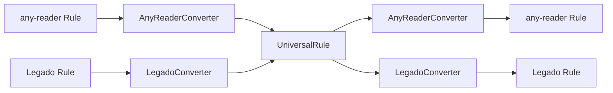

# 通用规则规范设计方案

设计一套跨平台的通用规则规范，支持 any-reader 与 Legado 规则的双向转换，包含规则字段映射和表达式语法转换。

## 设计决策（已确认）

> [!NOTE]
> 以下关键设计决策已确认：
>
> 1. ✅ **详情页流程**：通用规则支持详情页流程（兼容 Legado 的详情页步骤）
> 2. ✅ **特殊字段**：保留所有特殊字段，使用 `_fieldSources` 标记字段来源平台
> 3. ✅ **表达式语法**：采用 any-reader 风格（统一小写前缀 `@css:`、`@xpath:`、`@json:`、`@js:`）
> 4. ✅ **选择器类型**：仅保留 CSS、XPath、JSONPath、JavaScript、正则（移除 JSOUP Default，因 CSS/XPath 已可满足需求）

---

## 一、通用规则规范设计

### 1.1 设计原则

- **超集原则**：通用规则包含两种格式的所有字段
- **语义映射**：相同功能的字段统一命名
- **可选兼容**：特有字段标记为可选，避免转换丢失
- **表达式统一**：定义标准表达式语法，支持互转

### 1.2 通用规则类型定义

```typescript
/**
 * 通用规则类型 (Universal Rule)
 * 兼容 any-reader 和 Legado 的超集设计
 */
export interface UniversalRule {
  // ===== 基本信息 =====
  id: string // 唯一标识
  name: string // 规则名称
  host: string // 域名
  icon?: string // 图标 URL
  author?: string // 作者
  group?: string // 分组 (Legado: bookSourceGroup)
  sort?: number // 排序权重

  // ===== 内容类型 =====
  contentType: UniversalContentType // 统一内容类型

  // ===== 特殊字段来源标记 =====
  // 用于标识字段仅被特定平台支持
  _fieldSources?: Record<string, 'any-reader' | 'legado' | 'both'>

  // ===== 请求设置 =====
  userAgent?: string // User-Agent
  headers?: Record<string, string> // 请求头 (Legado: header)
  loadJs?: string // 全局 JS 脚本

  // ===== 搜索规则 =====
  search?: {
    enabled: boolean // 是否启用
    url: string // 搜索 URL 模板
    list: string // 列表选择器
    name: string // 名称选择器
    cover?: string // 封面选择器
    author?: string // 作者选择器
    description?: string // 描述选择器
    latestChapter?: string // 最新章节 (Legado: lastChapter)
    wordCount?: string // 字数 (Legado only)
    tags?: string // 标签/分类 (Legado: kind)
    result: string // 结果 URL (跳转下一流程)
  }

  // ===== 详情页规则 =====
  // 支持 Legado 风格的详情页流程，any-reader 可选使用
  detail?: {
    enabled?: boolean // 是否启用详情页（any-reader 可跳过此步骤）
    url?: string // 详情页 URL (可从搜索结果获取)
    init?: string // 预处理规则 (Legado: bookInfoInit)
    name?: string // 书名
    author?: string // 作者
    cover?: string // 封面
    description?: string // 简介 (Legado: intro)
    latestChapter?: string // 最新章节
    wordCount?: string // 字数
    tags?: string // 分类
    tocUrl?: string // 目录 URL
    canRename?: boolean // 允许修改书名作者
  }

  // ===== 目录/章节规则 =====
  chapter?: {
    url?: string // 章节列表 URL
    list: string // 列表选择器
    name: string // 章节名选择器
    cover?: string // 封面选择器
    time?: string // 时间选择器
    result: string // 结果 URL (正文地址)
    nextUrl?: string // 下一页 URL
    isVip?: string // VIP 标识
    isPay?: string // 付费标识
    info?: string // 章节信息 (ChapterInfo)
    // 多线路支持
    multiRoads?: {
      enabled: boolean
      roads?: string // 线路列表选择器
      roadName?: string // 线路名选择器
    }
  }

  // ===== 发现页规则 =====
  discover?: {
    enabled: boolean // 是否启用
    url: string // 发现页 URL (支持分类格式)
    list: string // 列表选择器
    name: string // 名称选择器
    cover?: string // 封面选择器
    author?: string // 作者选择器
    description?: string // 描述选择器
    tags?: string // 标签选择器
    latestChapter?: string // 最新章节
    result: string // 结果 URL
    nextUrl?: string // 下一页 URL
  }

  // ===== 正文规则 =====
  content?: {
    url?: string // 正文页 URL
    items: string // 内容选择器
    nextUrl?: string // 下一页 URL
    decoder?: string // 解密器
    imageHeaders?: string // 图片请求头
    webView?: boolean // 使用 WebView 加载
    payAction?: string // 购买操作
    sourceRegex?: string // 资源正则
  }

  // ===== 登录规则 (Legado特有) =====
  login?: {
    url?: string // 登录 URL
    checkUrl?: string // 登录检测 URL
  }

  // ===== 元数据 =====
  _meta?: {
    sourceFormat: 'any-reader' | 'legado' | 'universal'
    version?: string
    createdAt?: number
    updatedAt?: number
    originalData?: unknown // 原始数据（用于无损转换）
  }
}

/**
 * 统一内容类型枚举
 */
export enum UniversalContentType {
  NOVEL = 'novel', // 小说/文字
  MANGA = 'manga', // 漫画/图片
  VIDEO = 'video', // 视频
  AUDIO = 'audio', // 音频/有声
  RSS = 'rss', // RSS 订阅
  NOVELMORE = 'novelmore' // 小说（更多功能）
}
```

---

## 二、通用表达式语法规范

### 2.1 表达式类型

| 类型       | 通用前缀                 | any-reader | Legado                |
| ---------- | ------------------------ | ---------- | --------------------- |
| CSS        | `@css:`                  | `@css:`    | `@css:`               |
| XPath      | `@xpath:`                | `@xpath:`  | `@XPath:` 或 `//`     |
| JSONPath   | `@json:`                 | `@json:`   | `@json:` 或 `$.`      |
| JavaScript | `@js:`                   | `@js:`     | `<js></js>` 或 `@js:` |
| 正则过滤   | `@regex:`                | `@filter:` | `:pattern`            |
| 正则替换   | `##pattern##replacement` | 相同       | 相同                  |

> [!NOTE]
> **关于 JSOUP Default 语法**：Legado 特有的 `class.name.0@tag.a@text` 语法在转换时会自动转换为等价的 CSS 或 XPath 表达式，无需单独支持。

### 2.2 通用表达式规范

```typescript
/**
 * 通用表达式结构
 */
export interface UniversalExpression {
  // 类型标识
  // css: CSS选择器, xpath: XPath路径, json: JSONPath, js: JavaScript代码, regex: 正则表达式
  // literal: 字面量字符串（不需要解析，直接使用的固定值，如固定URL、固定文本等）
  type: 'css' | 'xpath' | 'json' | 'js' | 'regex' | 'literal'

  // 表达式内容
  value: string

  // 后处理操作
  postProcess?: {
    // 属性提取 (CSS/XPath)
    attr?: string // 如: text, html, href, src

    // 正则替换
    replace?: {
      pattern: string
      replacement: string
      flags?: string // g, i, m 等
    }[]

    // 索引选择
    index?: number | 'first' | 'last' | 'all'
  }

  // 级联规则（链式处理）
  next?: UniversalExpression
}

/**
 * 表达式字符串格式规范：
 *
 * 基本格式: @type:selector@attr
 * 级联格式: @type:selector@attr && @type:selector
 * 或逻辑:   @type:selector || @type:selector
 * 正则替换: @type:selector##pattern##replacement
 *
 * 示例:
 * - @css:.title@text
 * - @xpath://div[@class="content"]/text()
 * - @json:$.data.list[0].title
 * - @js:result.map(x => x.name).join(',')
 * - @css:.info@text##\d+##数字
 */
```

### 2.3 特殊语法映射

| 功能       | 通用语法         | any-reader   | Legado        |
| ---------- | ---------------- | ------------ | ------------- |
| 模板变量   | `{{key}}`        | `{{key}}`    | `{{key}}`     |
| 搜索关键词 | `{{keyword}}`    | `$keyword`   | `{{key}}`     |
| 分页变量   | `{{page}}`       | `$page`      | `{{page}}`    |
| 域名变量   | `{{host}}`       | `$host`      | `{{baseUrl}}` |
| 结果变量   | `{{result}}`     | `result`     | `result`      |
| 上级结果   | `{{lastResult}}` | `lastResult` | `lastResult`  |
| 或逻辑     | `\|\|`           | `\|\|`       | `\|\|`        |
| 与逻辑     | `&&`             | `&&`         | `&&`          |
| 交替取数   | `%%`             | 不支持       | `%%`          |
| 列表反序   | `@reverse`       | 不支持       | `-` 前缀      |

---

## 三、规则转换器设计

### 3.1 转换器架构



### 3.2 文件结构

```
src/renderer/src/
├── types/
│   ├── index.ts              # 现有类型定义
│   ├── universal.ts          # [NEW] 通用规则类型
│   └── expression.ts         # [NEW] 表达式类型
├── converters/               # [NEW] 转换器目录
│   ├── index.ts              # 导出入口
│   ├── base.ts               # 基础转换器接口
│   ├── any-reader.ts         # any-reader 转换器
│   ├── legado.ts             # Legado 转换器
│   └── expression/           # 表达式转换器
│       ├── parser.ts         # 表达式解析器
│       ├── any-reader.ts     # any-reader 表达式转换
│       └── legado.ts         # Legado 表达式转换
└── utils/
    └── rule-utils.ts         # [NEW] 规则工具函数
```

---

## 四、转换器接口定义

### 4.1 基础转换器接口

```typescript
export interface RuleConverter<T> {
  // 转为通用规则
  toUniversal(rule: T): UniversalRule

  // 从通用规则转换
  fromUniversal(rule: UniversalRule): T

  // 验证规则有效性
  validate(rule: T): ValidationResult
}
```

### 4.2 any-reader 转换器

```typescript
export class AnyReaderConverter implements RuleConverter<Rule> {
  toUniversal(rule: Rule): UniversalRule { ... }
  fromUniversal(rule: UniversalRule): Rule { ... }
  validate(rule: Rule): ValidationResult { ... }
}
```

字段映射关系：

- `searchResult` → `search.result`
- `chapterList` → `chapter.list`
- `contentItems` → `content.items`
- `enableSearch` → `search.enabled`

### 4.3 Legado 转换器

```typescript
export class LegadoConverter implements RuleConverter<LegadoRule> {
  toUniversal(rule: LegadoRule): UniversalRule { ... }
  fromUniversal(rule: UniversalRule): LegadoRule { ... }
  validate(rule: LegadoRule): ValidationResult { ... }
}
```

字段映射关系：

- `bookSourceUrl` → `id`
- `bookSourceName` → `name`
- `ruleSearch.bookList` → `search.list`
- `ruleToc.chapterList` → `chapter.list`
- `ruleContent.content` → `content.items`

---

## 五、表达式转换器

### 5.1 统一表达式解析器

```typescript
export function parseExpression(expr: string): UniversalExpression
export function stringifyExpression(expr: UniversalExpression): string
```

### 5.2 any-reader 表达式转换

```typescript
// any-reader → 通用
export function fromAnyReaderExpr(expr: string): string
// 通用 → any-reader
export function toAnyReaderExpr(expr: string): string
```

转换规则：

- `@css:` ↔ `@css:`（保持不变）
- `@xpath:` ↔ `@xpath:`（保持不变）
- `@json:` ↔ `@json:`（保持不变）
- `@js:` ↔ `@js:`（保持不变）
- `@filter:` → `@regex:`
- `$host` ↔ `{{host}}`

### 5.3 Legado 表达式转换

```typescript
// Legado → 通用
export function fromLegadoExpr(expr: string): string
// 通用 → Legado
export function toLegadoExpr(expr: string): string
```

转换规则：

- `@XPath:` → `@xpath:`
- `//` 开头 → `@xpath://`
- `$.` 开头 → `@json:$`
- `<js></js>` → `@js:`
- `class.name.0@tag.a@text` → 转换为等价的 `@css:` 或 `@xpath:` 表达式
- `{{key}}` ↔ `{{keyword}}`
- `-` 列表前缀 → `@reverse()`

---

## 六、规则工具函数

```typescript
// 检测规则格式
export function detectRuleFormat(rule: unknown): 'any-reader' | 'legado' | 'universal' | 'unknown'

// 智能转换（自动检测并转换）
export function convertRule(
  rule: unknown,
  targetFormat: 'any-reader' | 'legado' | 'universal'
): unknown

// 规则校验
export function validateRule(rule: unknown): ValidationResult

// 规则合并（用于导入时处理冲突）
export function mergeRules(existing: UniversalRule, incoming: UniversalRule): UniversalRule
```

---

## 七、内容类型映射表

| 通用类型 | any-reader  | Legado              |
| -------- | ----------- | ------------------- |
| `novel`  | `1` (NOVEL) | `bookSourceType: 0` |
| `audio`  | `3` (AUDIO) | `bookSourceType: 1` |
| `manga`  | `0` (MANGA) | 不支持（需扩展）    |
| `video`  | `2` (VIDEO) | 不支持（需扩展）    |
| `rss`    | `4` (RSS)   | 不支持              |

---

## 八、字段映射完整对照表

### 基本信息

| 通用字段    | any-reader            | Legado                           |
| ----------- | --------------------- | -------------------------------- |
| `id`        | `id`                  | `bookSourceUrl`                  |
| `name`      | `name`                | `bookSourceName`                 |
| `host`      | `host`                | 从 `bookSourceUrl` 提取          |
| `icon`      | `icon`                | `bookSourceUrl` + `/favicon.ico` |
| `author`    | `author`              | -                                |
| `group`     | -                     | `bookSourceGroup`                |
| `sort`      | `sort`                | `customOrder`                    |
| `userAgent` | `userAgent`           | `header.User-Agent`              |
| `headers`   | 通过 `userAgent` JSON | `header`                         |
| `loadJs`    | `loadJs`              | -                                |

### 搜索规则

| 通用字段               | any-reader          | Legado                   |
| ---------------------- | ------------------- | ------------------------ |
| `search.enabled`       | `enableSearch`      | 有 `searchUrl` 即启用    |
| `search.url`           | `searchUrl`         | `searchUrl`              |
| `search.list`          | `searchList`        | `ruleSearch.bookList`    |
| `search.name`          | `searchName`        | `ruleSearch.name`        |
| `search.cover`         | `searchCover`       | `ruleSearch.coverUrl`    |
| `search.author`        | `searchAuthor`      | `ruleSearch.author`      |
| `search.description`   | `searchDescription` | `ruleSearch.intro`       |
| `search.latestChapter` | `searchChapter`     | `ruleSearch.lastChapter` |
| `search.wordCount`     | -                   | `ruleSearch.wordCount`   |
| `search.tags`          | `searchTags`        | `ruleSearch.kind`        |
| `search.result`        | `searchResult`      | `ruleSearch.bookUrl`     |

### 详情页规则

| 通用字段               | any-reader | Legado                     |
| ---------------------- | ---------- | -------------------------- |
| `detail.init`          | -          | `ruleBookInfo.init`        |
| `detail.name`          | -          | `ruleBookInfo.name`        |
| `detail.author`        | -          | `ruleBookInfo.author`      |
| `detail.cover`         | -          | `ruleBookInfo.coverUrl`    |
| `detail.description`   | -          | `ruleBookInfo.intro`       |
| `detail.latestChapter` | -          | `ruleBookInfo.lastChapter` |
| `detail.wordCount`     | -          | `ruleBookInfo.wordCount`   |
| `detail.tags`          | -          | `ruleBookInfo.kind`        |
| `detail.tocUrl`        | -          | `ruleBookInfo.tocUrl`      |
| `detail.canRename`     | -          | `ruleBookInfo.canReName`   |

### 目录规则

| 通用字段          | any-reader       | Legado                |
| ----------------- | ---------------- | --------------------- |
| `chapter.url`     | `chapterUrl`     | -                     |
| `chapter.list`    | `chapterList`    | `ruleToc.chapterList` |
| `chapter.name`    | `chapterName`    | `ruleToc.chapterName` |
| `chapter.cover`   | `chapterCover`   | -                     |
| `chapter.time`    | `chapterTime`    | `ruleToc.updateTime`  |
| `chapter.result`  | `chapterResult`  | `ruleToc.chapterUrl`  |
| `chapter.nextUrl` | `chapterNextUrl` | `ruleToc.nextTocUrl`  |
| `chapter.isVip`   | -                | `ruleToc.isVip`       |

### 正文规则

| 通用字段          | any-reader       | Legado                       |
| ----------------- | ---------------- | ---------------------------- |
| `content.url`     | `contentUrl`     | -                            |
| `content.items`   | `contentItems`   | `ruleContent.content`        |
| `content.nextUrl` | `contentNextUrl` | `ruleContent.nextContentUrl` |
| `content.decoder` | `contentDecoder` | -                            |
| `content.webView` | -                | URL 中的 `webView` 参数      |

---

## 九、实施建议

### 阶段一：类型定义（优先）

1. 创建 `universal.ts` 定义通用规则类型
2. 创建 `expression.ts` 定义表达式类型
3. 不影响现有功能

### 阶段二：转换器实现

1. 实现 any-reader 转换器（与现有类型兼容）
2. 实现 Legado 转换器
3. 添加导入/导出支持

### 阶段三：表达式处理

1. 实现表达式解析器
2. 处理语法差异转换
3. 确保规则可正常执行

### 阶段四：集成测试

1. 批量规则转换测试
2. 功能验证测试
3. 边界情况处理
