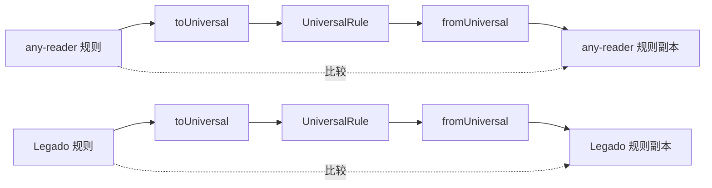

# Scripts脚本说明

本目录包含项目开发和测试相关的脚本工具。

## 脚本列表

| 脚本                 | 用途                                  | 运行命令                             |
| -------------------- | ------------------------------------- | ------------------------------------ |
| `test-conversion.ts` | 规则格式转换测试（自动扫描+中间文件） | `npx tsx scripts/test-conversion.ts` |
| `test-roundtrip.ts`  | 规则格式转换往返一致性测试（旧版）    | `npx tsx scripts/test-roundtrip.ts`  |

---

## test-conversion.ts

### 功能概述

**规则转换测试脚本**，自动扫描 `test_rules` 目录下的非通用规则（anyReader、legado），执行往返转换测试，并将转换过程中生成的中间文件保存到 `tmp/` 临时目录。

### 核心特性

1. **自动扫描**：遍历 `test_rules/anyReader` 和 `test_rules/legado` 目录下所有 `.json` 文件
2. **中间文件保存**：
   - `*_universal.json` - 转换为通用格式的结果
   - `*_roundtrip.json` - 往返转换后的原格式
3. **差异报告**：详细输出每个字段的变化
4. **平台统计**：按平台分类统计测试结果

### 运行方式

```bash
npx tsx scripts/test-conversion.ts
```

### 转换流程

```mermaid
graph TB
    subgraph 输入
        A[test_rules/anyReader/*.json]
        B[test_rules/legado/*.json]
    end

    subgraph 转换流程
        C[读取原始规则]
        D[转换为 UniversalRule]
        E[转换回原格式]
        F[深度比较差异]
    end

    subgraph 输出
        G[tmp/anyReader/规则名_universal.json]
        H[tmp/anyReader/规则名_roundtrip.json]
        I[tmp/legado/规则名_universal.json]
        J[tmp/legado/规则名_roundtrip.json]K[控制台报告]
    end

    A --> C
    B --> C
    C --> D --> G & I
    D --> E --> H & J
    E --> F --> K
```

### 输出文件结构

```
tmp/
├── anyReader/
│   ├── 17k小说_universal.json     # 转换后的通用格式
│   ├── 17k小说_roundtrip.json     # 往返转换后的原格式
│   ├── 腾讯漫画_universal.json
│   └── 腾讯漫画_roundtrip.json
└── legado/
    ├── 3A小说_universal.json
    └── 3A小说_roundtrip.json
```

### 深度比较算法

脚本使用递归深度比较算法检测转换前后的字段差异：

1. **空值统一处理**：`undefined`, `null`, `""` 视为等价
2. **递归对象比较**：逐层比较嵌套对象
3. **数组 JSON 序列化比较**：确保数组元素顺序和值一致
4. **类型检查**：检测类型变化（数字和字符串的转换被特殊处理）

### 忽略字段

以下字段在比较时被忽略（元数据或暂未实现转换）：

| 字段               | 忽略原因                    |
| ------------------ | --------------------------- |
| `_meta`            | 转换过程会重新生成元数据    |
| `_fieldSources`    | 内部字段来源追踪            |
| `createTime`       | 时间戳字段                  |
| `modifiedTime`     | 时间戳字段                  |
| `lastUpdateTime`   | 时间戳字段                  |
| `id`               | ID 可能因转换策略变化       |
| `bookSourceUrl`    | Legado 特有字段可能重新生成 |
| `customButton`     | 暂未实现转换                |
| `eventListener`    | 暂未实现转换                |
| `enableMultiRoads` | 暂未实现转换                |
| `enabled`          | 布尔值 false 可能不保留     |
| `enabledExplore`   | 布尔值 false 可能不保留     |
| `enabledCookieJar` | 布尔值 false 可能不保留     |
| `enableUpload`     | 布尔值 false 可能不保留     |

### 输出示例

**成功情况：**

```
🧪 规则转换测试

============================================================

📁 临时文件目录: /path/to/project/tmp

📦 处理 anyReader 规则...
----------------------------------------✅ 17k小说📄 Universal: tmp/anyReader/17k小说_universal.json
    📄 Roundtrip: tmp/anyReader/17k小说_roundtrip.json
  ✅ 腾讯漫画
    📄 Universal: tmp/anyReader/腾讯漫画_universal.json
    📄 Roundtrip: tmp/anyReader/腾讯漫画_roundtrip.json

📦 处理 legado 规则...
----------------------------------------
  ✅ 3A小说
    📄 Universal: tmp/legado/3A小说_universal.json
    📄 Roundtrip: tmp/legado/3A小说_roundtrip.json

============================================================

📊 测试总结通过: 3
  失败: 0
  总计: 3按平台统计:
    anyReader: 2/2通过
    legado: 1/1通过

📁 中间文件已保存到: tmp/

🎉 所有测试通过!
```

**发现差异情况：**

```
📦 处理 anyReader 规则...
----------------------------------------
  ❌ 17k小说
  差异:
    - searchUrl:
      原始: "http://api.17k.com/search?keyword=$keyword"
      往返: "http://api.17k.com/search?keyword={{keyword}}"
    - contentType:
      原始: 1
      往返: "novel"
    📄 Universal: tmp/anyReader/17k小说_universal.json
    📄 Roundtrip: tmp/anyReader/17k小说_roundtrip.json
```

---

## test-roundtrip.ts

### 功能概述

**规则格式转换往返测试脚本（旧版）**，用于验证书源规则在不同格式之间转换的一致性。测试流程：

```
原始规则 → 转换为 UniversalRule → 转换回原格式 → 比较差异
```

> **注意**：此脚本为旧版实现，使用硬编码的测试文件路径。建议使用新版`test-conversion.ts` 脚本。

### 运行方式

```bash
npx tsx scripts/test-roundtrip.ts
```

### 测试原理

#### 往返转换流程



### 测试数据目录

脚本从 `test_rules/` 目录加载测试规则：

```
test_rules/
├── anyReader/           # any-reader 格式测试规则
│   ├── 17k小说.json
│   └── 腾讯漫画.json
├── legado/              # Legado 格式测试规则
│   └── 3A小说.json
└── universal/           # Universal 格式测试规则
    └── 漫小肆韓漫.json
```

> **注意**：旧版脚本需要测试文件放置在 `test_rules/any-reader.json` 和 `test_rules/Legado.json` 路径。

---

## 开发指南

### 添加新测试规则

1. 将新的测试规则 JSON 文件放入对应的 `test_rules/` 子目录：
   - `test_rules/anyReader/` - any-reader 格式规则
   - `test_rules/legado/` - Legado 格式规则
   - `test_rules/universal/` - 通用格式规则（不参与转换测试）

2. 运行测试脚本验证转换：

   ```bash
   npx tsx scripts/test-conversion.ts
   ```

3. 检查 `tmp/` 目录下生成的中间文件，分析转换结果

### 调试技巧

```bash
# 运行转换测试并查看详细输出
npx tsx scripts/test-conversion.ts

# 检查生成的中间文件
cat tmp/anyReader/17k小说_universal.json | jq .

# 比较原始文件和往返文件的差异
diff test_rules/anyReader/17k小说.json tmp/anyReader/17k小说_roundtrip.json
```

###扩展新平台支持

如需添加新的规则平台支持，修改 `test-conversion.ts` 中的 `RULE_DIRS` 配置：

```typescript
const RULE_DIRS: Record<string, RuleDirConfig> = {
  anyReader: {
    dir: 'anyReader',
    converter: anyReaderConverter as unknown as RuleDirConfig['converter']
  },
  legado: {
    dir: 'legado',
    converter: legadoConverter as unknown as RuleDirConfig['converter']
  },
  // 添加新平台
  newPlatform: {
    dir: 'newPlatform',
    converter: newPlatformConverter as unknown as RuleDirConfig['converter']
  }
}
```

### 相关源码

| 模块              | 路径                                                  |
| ----------------- | ----------------------------------------------------- |
| 表达式解析器      | `src/renderer/src/converters/expression/parser.ts`    |
| 变量转换器        | `src/renderer/src/converters/expression/variables.ts` |
| 表达式验证器      | `src/renderer/src/converters/expression/validator.ts` |
| any-reader 转换器 | `src/renderer/src/converters/any-reader.ts`           |
| Legado 转换器     | `src/renderer/src/converters/legado.ts`               |
| 表达式类型定义    | `src/renderer/src/types/expression.ts`                |
